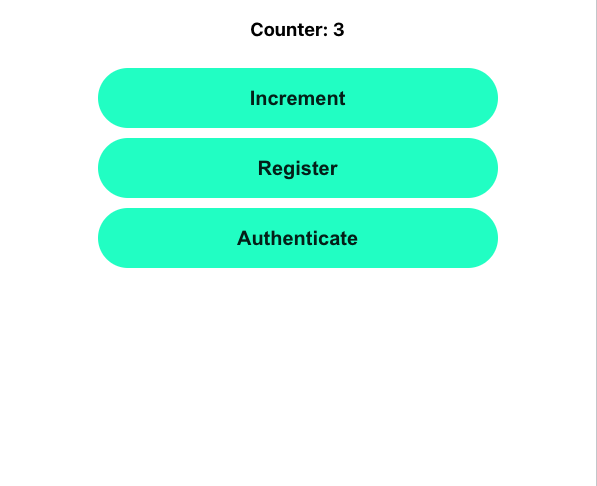

# Practice project connecting React app with fuels to Webauthn backend functionalities

Simple webapp that has:
- connection with the Fuel blockchain (Wallet in browser and deployed contract)
- webauthn integrated

## App Functionality

This is a totally unlogical app that has 1 text and 3 buttons. The goal is to see both Fuel stuff and WebAuthn stuff exist in 1 app and be able to use it as an example later. 
.

- Counter & Increment button have to do with Fuel
- Register & Authenticate button have to do with WebAuthn

Expected workings:
- click on Increment: should open up the Fuel browser wallet and ask for login + approval. When approved, after a few seconds of waiting `Counter` in the webpage must increment by 1. (Have a bit of patience)
- click on Register: should give a popup in browser for registration. Successfully going through these steps should give a message in the console "Registration successful"
- additionally, when clicking on Register some fuel code is executed as well to verify wallet addresses and in the console true or false is logged whether this was successful. (Doesn't make any sense but is only for practice)
- click on Authenticate when registered: should give a popup for authentication. Successfully going through these steps should give a message in the console "Authentication successful" 
- when Registration or Authentication fails it should give that as an error in the console


## Codebase explanation + instructions

The codebase consists of 3 parts:
- counter-contract; this is where the Sway contract lives. It is a simple counter contract from the Quickstart tutorial
- server; this is where the calls to webauthn live. Absolutely not production ready, it even has some hardcoded `expectedOrigin`s. This does registration and authentication, following an example repo
- frontend; the visual part that ties it all together. Calls both the server that does WebAuthn stuff & the contract onchain

Additionally, there is a little codesnippet in the server code (`server/src/index.ts`) that connects to the testnet and gets some data. This is also just for practice purpose, to see this is possible. 


### 1. Contract code

Tutorial: https://fuelbook.fuel.network/master/quickstart/smart-contract.html
Build and deploy to testnet. Use the contract id in the frontend (frontend/src/App.tsx).

```
forc build
forc deploy --node-url beta-3.fuel.network/graphql --gas-price 1 --random-salt
forc wallet sign --account `[the account index, without brackets]` tx-id `[Transaction id to sign, without brackets]`
# example: forc wallet sign --account 0 tx-id 16d7a8f9d15cfba1bd000d3f99cd4077dfa1fce2a6de83887afc3f739d6c84df
```

### 2. WebAuthn Server

Example code: https://github.com/MasterKale/SimpleWebAuthn/tree/master/example

This server code expects the frontend to run on port 3000. If this is not the case, change the hardcoded `expectedOrigin` in `server/src/index.ts`. 

```
npm install
npm start
```

### 3. Frontend

Tutorial: https://fuelbook.fuel.network/master/quickstart/frontend.html

Make sure the smart contract is deployed and the contract id is added to `App.tsx`. Furthermore, the server must be running on 127.0.0.1:8000, if it is somewhere else, this has to be adjusted in `frontend/package.json`, specifically `"proxy": "http://127.0.0.1:8000"`. 

Open the app in a browser where the Fuel wallet extension has been added and WebAuthn is supported. Open the console in the Developer Tools to see additional messages. 

```
npm install
npm start
```
